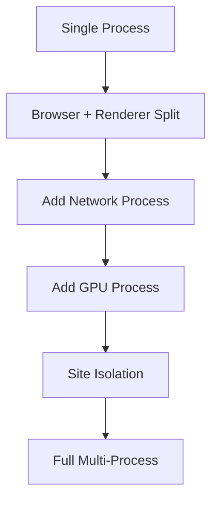

# Architecture Roadmap: Chromium Parity & Beyond

> Goal: Modern multi-process architecture with minimal overhead

## Current State
- Single-process model
- Custom memory management (tiered, arena)
- String interning, SIMD utilities

---

## Phase 1: Process Model (Q1)

### 1.1 Process Separation
| Process | Responsibility | Priority |
|---------|---------------|----------|
| Browser | UI, navigation, coordination | High |
| Renderer | DOM, layout, paint, JS | High |
| Network | All network I/O | Medium |
| GPU | Compositing, WebGL | Medium |
| Storage | IndexedDB, cache | Low |

```rust
pub struct ProcessArchitecture {
    browser: BrowserProcess,
    renderers: HashMap<TabId, RendererProcess>,
    network: Option<NetworkProcess>,
    gpu: Option<GpuProcess>,
}

impl ProcessArchitecture {
    pub fn spawn_renderer(&mut self, tab: TabId) -> Result<()> {
        let process = Command::new(std::env::current_exe()?)
            .arg("--type=renderer")
            .arg(format!("--tab={}", tab))
            .spawn()?;
        
        self.renderers.insert(tab, RendererProcess::new(process)?);
        Ok(())
    }
}
```

### 1.2 IPC Design
```rust
// Zero-copy IPC where possible
pub enum IpcMessage {
    // Small messages inline
    Inline(SmallVec<[u8; 64]>),
    // Large data via shared memory
    SharedMemory { handle: SharedMemHandle, offset: usize, len: usize },
    // File descriptors (Unix)
    #[cfg(unix)]
    FileDescriptor(RawFd),
}

pub struct IpcChannel {
    #[cfg(unix)]
    socket: UnixStream,
    #[cfg(windows)]
    pipe: NamedPipe,
}
```

---

## Phase 2: Memory Architecture (Q2)

### 2.1 Tiered Memory (Existing)
```rust
pub struct TieredMemory<T> {
    hot: Vec<T>,                    // Active, in-memory
    warm: CompressedStorage<T>,     // LZ4 compressed
    cold: DiskStorage<T>,           // Serialized to disk
    
    pub fn access(&mut self, idx: usize) -> &T {
        // Promote from cold → warm → hot on access
    }
}
```

### 2.2 Memory Budgets
| Component | Chromium | fOS Target |
|-----------|----------|------------|
| Renderer (per tab) | 100MB | 50MB |
| DOM (per page) | 20MB | 10MB |
| JS heap (per page) | 50MB | 30MB |
| Layout cache | 10MB | 5MB |
| GPU textures | 200MB | 100MB |

```rust
pub struct MemoryBudget {
    total_system: usize,
    per_tab: usize,
    
    pub fn should_hibernate(&self, tab: &Tab) -> bool {
        tab.last_active.elapsed() > Duration::from_secs(300)
            && self.memory_pressure() > 0.8
    }
}
```

---

## Phase 3: Threading Model (Q3)

### 3.1 Thread Pool Architecture
```rust
pub struct ThreadPool {
    // Work-stealing for CPU tasks
    cpu_workers: rayon::ThreadPool,
    
    // Dedicated I/O threads
    io_threads: Vec<IoThread>,
    
    // Compositor thread (timing-critical)
    compositor: CompositorThread,
    
    // Audio thread (real-time)
    audio: AudioThread,
}
```

### 3.2 Task Scheduling
```rust
pub enum TaskPriority {
    UserBlocking,      // Input, animation
    UserVisible,       // Visible content
    Background,        // Prefetch, GC
    Idle,              // Low priority cleanup
}

pub struct Scheduler {
    pub fn schedule(&self, task: Task, priority: TaskPriority) {
        match priority {
            TaskPriority::UserBlocking => self.run_immediately(task),
            TaskPriority::UserVisible => self.queue_high(task),
            TaskPriority::Background => self.queue_low(task),
            TaskPriority::Idle => self.queue_idle(task),
        }
    }
}
```

---

## Phase 4: Mojo Equivalent (Q4)

### 4.1 Interface Definition
```rust
// Trait-based interfaces (like Mojo)
#[derive(RemoteInterface)]
pub trait FrameHost {
    async fn navigate(&self, url: Url) -> NavigationResult;
    async fn execute_script(&self, script: String) -> JsValue;
    fn on_load_complete(&self) -> impl Stream<Item = LoadEvent>;
}

// Auto-generated IPC proxy
pub struct FrameHostProxy {
    channel: IpcChannel,
}

impl FrameHost for FrameHostProxy {
    async fn navigate(&self, url: Url) -> NavigationResult {
        self.channel.call(NavigateRequest { url }).await
    }
}
```

### 4.2 Message Serialization
```rust
pub trait IpcSerialize {
    fn serialize(&self, buf: &mut Vec<u8>);
    fn deserialize(buf: &[u8]) -> Result<Self, IpcError>;
}

// Use postcard (compact binary) or custom format
// Avoid serde for hot paths
```

---

## Phase 5: Startup Optimization

### 5.1 Cold Start
| Phase | Chromium | fOS Target |
|-------|----------|------------|
| Process spawn | 20ms | 10ms |
| Browser init | 30ms | 15ms |
| First paint | 150ms | 80ms |

```rust
pub struct StartupOptimizer {
    // Pre-fork renderer processes
    prefork_pool: Vec<RendererProcess>,
    
    // Memory-map common data
    shared_data: MmapedData,
    
    // Lazy init non-critical subsystems
    lazy_subsystems: Vec<LazyInit<Box<dyn Subsystem>>>,
}
```

### 5.2 Profile-Guided Initialization
```rust
pub fn initialize_by_profile(profile: &StartupProfile) {
    // Load most-likely-needed resources first
    for origin in profile.frequent_origins.iter().take(5) {
        dns_prefetch(origin);
        preconnect(origin);
    }
}
```

---

## Phase 6: Surpassing Chromium

### 6.1 Unique Architectural Features
| Feature | Description | Chromium? |
|---------|-------------|-----------|
| **Rust safety** | No UAF across processes | No |
| **Tiered memory** | Automatic hot/cold | No |
| **Zero-copy IPC** | Shared memory first | Partial |
| **Lazy everything** | On-demand init | Partial |

### 6.2 Minimal Binary Size
```rust
// Feature flags at compile time
#[cfg(feature = "webrtc")]
mod webrtc;

#[cfg(feature = "devtools")]
mod devtools;

// Strip unused codecs, features for minimal builds
```

| Build | Chromium | fOS Target |
|-------|----------|------------|
| Full | 120MB | 30MB |
| Minimal | N/A | 10MB |
| Core only | N/A | 5MB |

---

## Implementation Order



---

## Dependencies Policy

### Keep
- OS process APIs
- Shared memory primitives

### Custom Implementation
1. IPC channel abstraction
2. Process spawner
3. Interface IDL compiler
4. Memory pressure monitor
5. Scheduler with priorities
