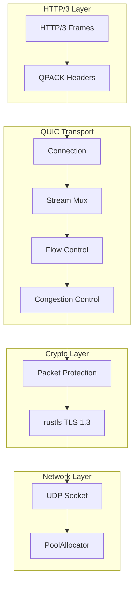

# Custom QUIC and HTTP/3 Implementation Roadmap

> **Status**: Future work - HTTP/2 implemented, QUIC/HTTP/3 deferred for custom implementation
> **Rationale**: Avoid external dependencies (quinn/tokio), integrate with fOS runtime (smol)

## Overview

This roadmap outlines the implementation of a custom QUIC transport and HTTP/3 protocol layer for fOS-engine. The goal is a zero-external-dependency implementation that integrates with existing fOS infrastructure.

---

## Phase 1: UDP Foundation

**Estimated effort**: 1-2 weeks

### Tasks
- [ ] Create `udp.rs` - UDP socket handling with non-blocking I/O
- [ ] Implement packet buffering with `PoolAllocator`
- [ ] Add source address validation for anti-amplification
- [ ] Integrate with `smol` async runtime

### Key Types
```rust
pub struct UdpSocket { ... }
pub struct Datagram { data: Vec<u8>, addr: SocketAddr }
```

---

## Phase 2: QUIC Packet Layer

**Estimated effort**: 2-3 weeks

### Tasks
- [ ] Implement QUIC packet parsing (Long/Short headers)
- [ ] Add QUIC version negotiation
- [ ] Implement connection ID management
- [ ] Add packet number encoding/decoding

### Packet Types
- Initial packets
- Handshake packets  
- Retry packets
- 0-RTT packets
- 1-RTT (short header) packets

---

## Phase 3: QUIC Crypto Integration

**Estimated effort**: 2-3 weeks

### Tasks
- [ ] Integrate with existing `rustls` for TLS 1.3
- [ ] Implement Initial packet protection (QUIC-specific)
- [ ] Add handshake packet protection
- [ ] Implement 1-RTT key derivation
- [ ] Add 0-RTT early data support

### Dependencies
- Reuse existing `rustls` setup from `tls.rs`
- Use `ring` (already pulled in by rustls) for crypto primitives

---

## Phase 4: QUIC Transport

**Estimated effort**: 3-4 weeks

### Tasks
- [ ] Implement connection state machine
- [ ] Add stream multiplexing
- [ ] Implement flow control (connection & stream level)
- [ ] Add congestion control (New Reno or Cubic)
- [ ] Implement loss detection and recovery
- [ ] Add connection migration support

### Key Types
```rust
pub struct QuicConnection {
    state: ConnectionState,
    streams: HashMap<u64, QuicStream>,
    crypto: QuicCrypto,
    flow_control: FlowController,
    congestion: CongestionController,
}
```

---

## Phase 5: HTTP/3 Framing

**Estimated effort**: 1-2 weeks

### Tasks
- [ ] Implement HTTP/3 frame types (HEADERS, DATA, SETTINGS, etc.)
- [ ] Update existing QPACK encoder/decoder in `http3.rs`
- [ ] Add control stream handling
- [ ] Implement request/response multiplexing
- [ ] Add server push support

---

## Phase 6: Client Integration

**Estimated effort**: 1 week

### Tasks
- [ ] Add HTTP/3 client to `HttpClient`
- [ ] Implement Alt-Svc header parsing for HTTP/3 discovery
- [ ] Add graceful fallback to HTTP/2 → HTTP/1.1
- [ ] Integrate with `ConnectionPool`

---

## Architecture



---

## Integration Points with fOS

| fOS Component | Usage in QUIC |
|---------------|---------------|
| `PoolAllocator` | Packet buffer management |
| `ConnectionPool` | HTTP/3 connection reuse |
| `StringInterner` | Header name interning in QPACK |
| `smol` | Async I/O runtime |
| `rustls` | TLS 1.3 crypto |

---

## Performance Targets

| Metric | Target |
|--------|--------|
| Handshake latency | < 1-RTT for resumption |
| Memory per connection | < 64KB baseline |
| Concurrent streams | 100+ per connection |
| 0-RTT support | Yes |

---

## References

- [RFC 9000](https://www.rfc-editor.org/rfc/rfc9000) - QUIC Transport
- [RFC 9001](https://www.rfc-editor.org/rfc/rfc9001) - QUIC-TLS Integration  
- [RFC 9002](https://www.rfc-editor.org/rfc/rfc9002) - QUIC Loss Detection
- [RFC 9114](https://www.rfc-editor.org/rfc/rfc9114) - HTTP/3
- [RFC 9204](https://www.rfc-editor.org/rfc/rfc9204) - QPACK
